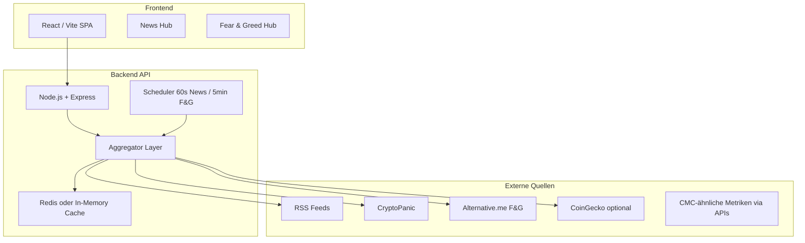

# TokenSync — Projektplan (Crypto Informationsplattform)

> **Status:** Planung abgeschlossen · Bereit für Umsetzung in Phasen  
> **Letzte Aktualisierung:** 2026-05-22  
> **Ziel:** Detailreiche Informations-Webseite mit Fokus auf **Crypto News** und **Fear & Greed**

---

## 1. Vision & Produktziel

**TokenSync** ist zunächst eine **informationsorientierte** Crypto-Webseite (kein Trading, keine Wallet-Anbindung in Phase 1). Nutzer sollen:

- aktuelle, **echte** Nachrichten aus der Finanz- und Crypto-Welt lesen — strukturiert, mit Bildern, filterbar;
- einen **umfassenden Fear-&-Greed-Bereich** nutzen — vergleichbar mit CoinMarketCap, mit vielen Detailansichten und aktuellen Daten aus mehreren Quellen.

**Qualitätsprinzipien (vom Auftraggeber):**

| Nach jedem Task | Aktion |
|-----------------|--------|
| Abschluss | Sicherheits- & Bug-Check |
| Erfolg | Backup unter `backups/backup-YYYY-MM-DD-HH-mm/` |
| Arbeitsweise | Professionell, fokussiert, schnell |

---

## 2. Architektur-Überblick



**Warum Backend?**

- News- und F&G-APIs haben **CORS**, **Rate Limits** und **API-Keys** → Keys nur serverseitig.
- **1-Minuten-Aktualisierung** zentral per Cron/Scheduler, nicht von jedem Browser-Tab einzeln.
- Einheitliches Datenmodell, Deduplizierung, Qualitätsfilter.

---

## 3. Tech-Stack (Empfehlung Phase 1)

| Schicht | Technologie | Begründung |
|---------|-------------|------------|
| Frontend | **Vite + React + TypeScript** | Schnell, modern, gut für Dashboard-UI |
| Styling | **Tailwind CSS** | Professionelles Layout, Dark Mode für Crypto |
| Backend | **Node.js + Express** | Einfacher Proxy/Aggregator, ein Ökosystem mit Frontend |
| Cache | **node-cache** (Start) → **Redis** (Skalierung) | 60s TTL für News, kürzer für F&G-Komponenten |
| Daten | JSON-Dateien / SQLite (optional) | Historische F&G-Snapshots ohne Cloud-Pflicht |
| Deploy (später) | Vercel/Netlify (FE) + Railway/Render (BE) | Getrennt skalierbar |

**Alternative (falls gewünscht):** Next.js Full-Stack — ein Repo, API Routes statt separatem Express-Server.

---

## 4. Feature 1 — Crypto News Hub

### 4.1 Anforderungen

- Quellen: **so viele wie möglich** (RSS + APIs).
- Aktualisierung: **alle 60 Sekunden** (serverseitig; Frontend pollt z. B. alle 30–60s).
- Inhalt: echt, relevant (Crypto + breitere Finanzwelt), **dedupliziert**, mit **Bild**, Titel, Quelle, Zeit, Kategorie, optional Sentiment.
- Darstellung: **gut strukturiert** — Karten-Grid, Featured Story, Filter (Quelle, Kategorie, „nur Crypto“), Detailseite mit Volltext/Link zur Originalquelle.

### 4.2 Quellen-Matrix (Phase 1 → 2)

| Quelle | Typ | Inhalt | Auth |
|--------|-----|--------|------|
| CoinDesk | RSS | Crypto News | Nein |
| Cointelegraph | RSS | Crypto News | Nein |
| Decrypt | RSS | Crypto News | Nein |
| Bitcoin Magazine | RSS | Crypto | Nein |
| The Block | RSS | Crypto / Markets | Nein |
| Reuters Markets (Crypto-Filter) | RSS | Finanz + Crypto | Nein |
| Financial Times / WSJ | RSS (Snippet) | Makro/Finanz | Teilweise Paywall → nur Teaser + Link |
| CryptoPanic | API | Aggregiert, Hot/Trending | API Key (free tier) |
| NewsAPI.org | API | Keyword: bitcoin, ethereum, crypto | API Key |
| CoinGecko | API | Trending (ergänzend) | Free tier |

**Phase 2 Erweiterung:** Messari, LunarCrush Sentiment, Benzinga Crypto RSS, CryptoSlate.

### 4.3 Datenmodell (vereinheitlicht)

```ts
interface NewsArticle {
  id: string;              // hash(url) oder uuid
  title: string;
  summary: string;
  content?: string;        // falls RSS full content
  imageUrl?: string;
  source: string;          // „CoinDesk“
  sourceId: string;
  url: string;             // Original-Link (rel=noopener)
  publishedAt: ISO8601;
  categories: string[];    // crypto, defi, regulation, macro
  tags: string[];
  sentiment?: 'bullish' | 'bearish' | 'neutral';
  isDuplicateOf?: string;  // Dedup-Referenz
}
```

### 4.4 Aggregator-Logik

1. **Fetch** parallel (RSS parser `rss-parser`, HTTP mit Timeout).
2. **Normalize** → ein Schema.
3. **Dedup** — gleicher Titel (>85% Ähnlichkeit) oder gleiche URL.
4. **Rank** — Recency + Quellen-Gewicht + „Featured“ (Breaking, hohe Quelle).
5. **Cache** 60s; bei Fehler einer Quelle: Rest bleibt online.
6. **Bild-Fallback** — OG-Image scrape (sparsam) oder Kategorie-Placeholder.

### 4.5 UI-Struktur News

- **Start:** Hero + „Top Stories“ (3 große Karten mit Bild).
- **Feed:** Masonry/Grid, Infinite Scroll oder Pagination.
- **Sidebar:** Trending Tags, Quellen-Filter, „Letzte Aktualisierung: vor Xs“.
- **Detail:** Vollansicht, verwandte Artikel, Share, Link „Zur Quelle“.

---

## 5. Feature 2 — Fear & Greed Hub (CMC-ähnlich)

### 5.1 Anforderungen

- **Sehr aktuell** — Composite Index aus mehreren Signalen.
- **Viele Unterfunktionen** — nicht nur eine Zahl.
- Optik/UX orientiert an **CoinMarketCap Fear & Greed** (Gauge, Historie, Erklärungen).

### 5.2 Datenquellen

| Quelle | Metrik | Intervall | Auth |
|--------|--------|-----------|------|
| **Alternative.me** | Offizieller Crypto F&G Index (0–100) | Täglich, API free | Nein |
| **CoinGecko** | BTC Dominance, Market Cap Change | 5 min | Free |
| **Eigenes Composite** | Gewichtete Mischung mehrerer Signale | 5 min | Intern |

**Composite-Signale (eigene Berechnung, Phase 2):**

- Volatilität (24h BTC/ETH)
- Markt-Momentum (7d/30d Performance Top-10)
- Social Volume (optional API)
- BTC Dominance Trend
- Stablecoin Flow Proxy (wenn API verfügbar)

### 5.3 Unterfunktionen (F&G Hub)

| Modul | Beschreibung |
|-------|----------------|
| **Haupt-Gauge** | 0–100, Label (Extreme Fear → Extreme Greed), Farbverlauf |
| **Heute vs. Gestern** | Delta + Pfeil |
| **7 / 30 / 90 Tage Chart** | Liniendiagramm (Chart.js / Recharts) |
| **Historische Tabelle** | Datum, Wert, Klassifikation |
| **Komponenten-Breakdown** | Balken pro Teil-Index (Volatility, Momentum, …) |
| **Markt-Kontext** | BTC Preis, Dominance, Total Market Cap |
| **Erklärung** | Was bedeutet der Index? Wie wird er berechnet? |
| **Alerts (Phase 2)** | „Benachrichtige bei Extreme Fear“ (lokal/Browser) |
| **Vergleich** | Alternative.me vs. Composite side-by-side |

### 5.4 Datenmodell F&G

```ts
interface FearGreedSnapshot {
  timestamp: ISO8601;
  value: number;           // 0-100
  classification: string;  // Extreme Fear, Fear, Neutral, Greed, Extreme Greed
  source: 'alternative.me' | 'composite';
  components?: Record<string, number>;
}

interface FearGreedHistory {
  range: '7d' | '30d' | '90d' | '1y';
  points: FearGreedSnapshot[];
}
```

### 5.5 Aktualisierungsrhythmus

- **Alternative.me:** Cache 1h (API liefert 1x/Tag neu) + Anzeige „Stand: …“
- **Marktdaten (CoinGecko):** alle **5 Minuten**
- **Composite:** alle **5 Minuten** neu berechnen
- Frontend: Live-Countdown „Nächstes Update in …“

---

## 6. Seitenstruktur & Navigation

```
/                     → Dashboard (News-Highlights + F&G Mini-Gauge)
/news                 → News Hub (vollständiger Feed)
/news/:id             → Artikel-Detail
/fear-greed           → F&G Hub (alle Module)
/about                → Über TokenSync, Quellen, Disclaimer
```

**Design-Richtung:** Dark Theme, klare Typografie, viel Whitespace, professionell (Bloomberg/CMC-Mix), mobil responsive.

---

## 7. Sicherheit (Checkliste pro Task)

- API-Keys nur in `.env`, nie im Frontend/Git.
- `helmet`, Rate Limiting auf API-Routes.
- RSS/HTML: **sanitize** (DOMPurify / xss).
- Externe Links: `rel="noopener noreferrer"`.
- CORS: nur eigene Frontend-Origin.
- Keine User-Accounts in Phase 1 → weniger Angriffsfläche.
- Dependencies: `npm audit` nach jedem Task.

---

## 8. Backup-Strategie

Nach jedem **erfolgreichen** Task:

```
backups/backup-2026-05-22-14-30/
  ├── snapshot/          # Kopie relevanter Projektdateien
  └── MANIFEST.txt       # Task-Name, Dateien, Kurznotiz
```

Optional zusätzlich: Git-Commits auf Wunsch des Auftraggebers.

---

## 9. Umsetzungs-Roadmap (Phasen)

### Phase 0 — Foundation (Task 1)
- [ ] Repo-Struktur, Vite+React+TS, Express API
- [ ] Layout, Navigation, Dark Theme
- [ ] Health-Endpoint, Env-Template

### Phase 1 — News MVP (Tasks 2–4)
- [ ] RSS-Aggregator (min. 5 Quellen)
- [ ] 60s Cache + News API `GET /api/news`
- [ ] News UI: Grid, Filter, Detail, Bilder
- [ ] CryptoPanic oder NewsAPI (1 API-Quelle)

### Phase 2 — Fear & Greed MVP (Tasks 5–7)
- [ ] Alternative.me Integration + Historie
- [ ] Gauge + Charts (7/30/90 Tage)
- [ ] Markt-Kontext (CoinGecko)
- [ ] F&G Hub Seite mit allen Basis-Modulen

### Phase 3 — Qualität & Tiefe (Tasks 8+)
- [ ] Composite F&G Index
- [ ] Mehr News-Quellen, Sentiment, Featured-Algorithmus
- [ ] Performance, SEO, Meta-Tags
- [ ] Redis, Monitoring, Deploy

---

## 10. Projektstruktur (Ziel)

```
TokenSync Projekt/
├── PROJECT_PLAN.md          ← dieser Plan
├── WORKFLOW.md              ← Task-Regeln (Check, Backup)
├── backups/
├── client/                  # Vite React Frontend
│   ├── src/
│   │   ├── pages/
│   │   ├── components/
│   │   └── services/
├── server/                  # Express API
│   ├── routes/
│   ├── services/
│   │   ├── newsAggregator.ts
│   │   └── fearGreedService.ts
│   └── cache/
├── .env.example
└── package.json             # workspaces optional
```

---

## 11. API-Keys (vom Auftraggeber später)

```env
CRYPTOPANIC_API_KEY=
NEWS_API_KEY=
# CoinGecko & Alternative.me: meist ohne Key für Start
```

---

## 12. Rechtliches / Disclaimer

- News: nur **Teaser + Link** zur Quelle; keine vollständige Paywall-Umgehung.
- Footer: „Keine Anlageberatung“, Quellenangaben, Impressum (später).

---

## Bereit für Tasks

Wenn du **„Start Phase 0“** (oder konkrete Task-Nummern) schickst, beginne ich mit der Implementierung, inkl. Security-Check und Backup nach Abschluss.
